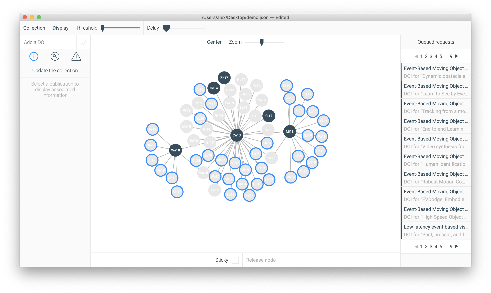

<p align="center">
    
</p>

Origami is an open-source research tool. It automatically scraps Google Scholar pages to retrieve "cited by" papers and presents the results as an interactive graph.



## Download

| [<div align="center"></div>](https://github.com/aMarcireau/origami/releases/download/v0.10.3/Origami-linux-x64.zip) | [<div align="center"></div>](https://github.com/aMarcireau/origami/releases/download/v0.10.3/Origami-darwin-x64.zip) | [<div align="center"></div>](https://github.com/aMarcireau/origami/releases/download/v0.10.3/Origami-win32-x64.zip) |
| ------------------------------------------------------------------------------------------------------------------------------------------------------------- | -------------------------------------------------------------------------------------------------------------------------------------------------------------- | --------------------------------------------------------------------------------------------------------------------------------------------------------------- |
| [Download for Linux](https://github.com/aMarcireau/origami/releases/download/v0.10.3/Origami-linux-x64.zip)                                                   | [Download for macOS](https://github.com/aMarcireau/origami/releases/download/v0.10.3/Origami-darwin-x64.zip)                                                   | [Download for Windows](https://github.com/aMarcireau/origami/releases/download/v0.10.3/Origami-win32-x64.zip)                                                   |

Visit the [Releases](https://github.com/aMarcireau/origami/releases) page to download Origami for other platforms.

## Color theme

To change the color theme, edit `colors.json`. You can find it at:

-   `Origami/resources/app/colors.json` on Linux
-   `Origami.app/Contents/Resources/app/colors.json` on macOS (right-click on the app and choose _Show Package Contents_)
-   `Origami\resources\app\colors.json` on Windows

The `themes` directory of this repository contains several themes suggestions.

## Formats

### Multiple DOIs import

Origami can load several DOIs at once from a [JSON](https://www.json.org) formated file with the following structure:

```yaml
[
    "10.1109/biorob.2016.7523449",
    "10.3389/fnins.2017.00350",
    "10.3389/fnins.2017.00535",
    "10.1109/tbcas.2017.2759700",
    "10.3389/fnins.2016.00594",
    "10.1007/s11263-017-1050-6",
]
```

### Saves

Origami saves and loads collections in [JSON](https://www.json.org) format. The generated files have the following structure:

```yaml
{
  "appVersion": "0.10.3", # the version of the app used to generate this save
  "display": 0, # the current display's index (0 for graph, 1 for list)
  "knownDois": ["10.1109/tpami.2016.2574707"], # list of DOIs clicked at least once (used to highlight new publications)
  "crossref": # pending requests to crossref.org
    [
      {
        "type": "CROSSREF_REQUEST_TYPE_VALIDATION",
        "doi": "10.1038/nature06293",
      },
      {
        "type": "CROSSREF_REQUEST_TYPE_CITER_METADATA",
        "parentDoi": "10.1109/tpami.2016.2574707",
        "title": "A Motion-Based Feature for Event-Based Pattern Recognition",
        "authors": ["X Clady", "JM Maro", "S Barré", "RB Benosman"],
        "dateAsString": "2017",
      },
      {
        "type": "CROSSREF_REQUEST_TYPE_IMPORTED_METADATA",
        "title": "EMVS: Event-Based Multi-View Stereo—3D Reconstruction with an Event Camera in Real-Time",
        "authors":
          [
            "Henri Rebecq",
            "Guillermo Gallego",
            "Elias Mueggler",
            "Davide Scaramuzza",
          ],
        "dateAsString": "2017",
      },
    ],
  "doi": [{ "doi": "10.1038/nature06293" }], # pending requests to doi.org
  "scholar": [ # pending requests to scholar.google.com
      "requests":
        [
          {
            "type": "SCHOLAR_REQUEST_TYPE_INITIALIZE",
            "doi": "10.3389/fnins.2016.00594",
            "url": "https://scholar.google.com/scholar?hl=en&q=10.3389%2Ffnins.2016.00594",
          },
          {
            "type": "SCHOLAR_REQUEST_TYPE_CITERS",
            "doi": "10.1109/biorob.2016.7523449",
            "url": "https://scholar.google.com/scholar?cites=3831926773876645447&start=0&hl=en",
            "number": 1,
            "total": 1,
          },
        ],
      "minimumRefractoryPeriod": 2000, # minimum waiting time between scholar requests, in milliseconds
      "maximumRefractoryPeriod": 8000, # maximum waiting time between scholar requests, in milliseconds
    ],
  "graph": {
      "threshold": 1, # the current threshold used to filter suggestions, non-zero integer
      "zoom": 0, # the current zoom level, integer in the range [-50, 50]
      "xOffset": 0, # the current graph positions' x coordinate, float
      "yOffset": 0, # the current graph positions' y coordinate, float
      "sticky": false, # false means that the 'sticky' box is unchecked
    },
  "publications": [ # list of known publications
      [
        # each publication is a two-elements list containg a string and an object
        "10.1109/tpami.2016.2574707", # the publication's DOI
        {
          # object containing the publication's data
          "status":
            "PUBLICATION_STATUS_IN_COLLECTION" # the publication's status in Origami, which can be:
            #     "PUBLICATION_STATUS_UNVALIDATED": the DOI was added, but not validated
            #     "PUBLICATION_STATUS_DEFAULT": suggested publication
            #     "PUBLICATION_STATUS_IN_COLLECTION": in-collection publication,
          "title": "HOTS: A Hierarchy of Event-Based Time-Surfaces for Pattern Recognition",
          "authors":
            [
              "Xavier Lagorce",
              "Garrick Orchard",
              "Francesco Galluppi",
              "Bertram E. Shi",
              "Ryad B. Benosman",
            ],
          "journal": "Institute of Electrical and Electronics Engineers (IEEE)",
          "date": [2016, 7, 14], # the publication's release date, list of one to three integer values (optional month and day)
          "citers":
            [
              "10.1109/biorob.2016.7523449",
              "10.3389/fnins.2017.00350",
              "10.3389/fnins.2017.00535",
              "10.1109/tbcas.2017.2759700",
              "10.3389/fnins.2016.00594",
              "10.1007/s11263-017-1050-6",
            ],
          "updated": 1513430331442, # last metadata update, in milliseconds since 1970-01-01
          "selected":
            false # false means that the publication is not selected
                  # only one publication can be selected
          "bibtex": "@article{...}", # the article's BibTeX as a string
          "x": 1.0813568646326681, # the publication's node position's x coordinate in the graph, float
          "y": -1.563450690825733, # the publication's node position's y coordinate in the graph, float
          "locked": false, # false means that the publication's node's position is not stuck
        },
      ],
    ],
  "search": "", # the current regular expression in the search input
  "tabs": 0, # the active tab (0 for information, 1 for search, 2 for warnings)
  "warnings": # list of warnings
    [
      {
        "title": "The Crossref request for 'Poker-DVS and MNIST-DVS. Their history, how they were made, and other details' failed",
        "subtitle": "The returned article was older than the cited one (10.1109/tpami.2016.2574707)",
        "level": "warning",
      },
    ],
}
```

## Contribute

### Install

Origami is build with [Electron](https://electronjs.org), [React](https://reactjs.org) and [Redux](https://redux.js.org).

Follow these steps to download the source code, edit and build Origami:

1. install [Node.js](https://nodejs.org)
2. clone the repository by running from a terminal `git clone https://github.com/aMarcireau/origami.git`
3. go to the created _origami_ folder and run `npm install`

For development, run the command `npm run-script watch` from the _origami_ folder. A development build is triggered every time a file in the _souce_ directory is modified.

To create a new release:

1. create a personal access token (see https://docs.github.com/en/authentication/keeping-your-account-and-data-secure/creating-a-personal-access-token)
2. create a file auth.json in the _origami_ directory with the following structure:

```json
{
    "username": "Github username",
    "token": "personal access token"
}
```

3. generate a production build for each supported platform with `npm run-script build`
4. create a new Github release (requires administration rights on this repository) with `npm run-script release`

To build Windows apps with macOS Catalina, one must patch Wine (see https://github.com/electron/node-rcedit/issues/51#issuecomment-546234084).

Code documentation: [Wiki](https://github.com/aMarcireau/origami/wiki).

## License

See the [LICENSE](LICENSE.txt) file for license rights and limitations (MIT).
